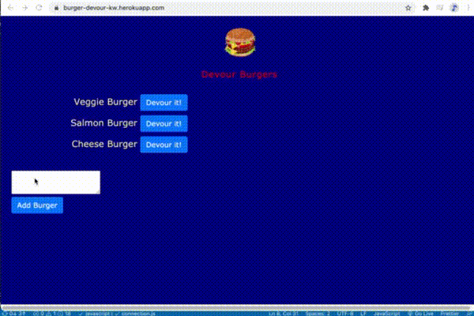

# EatABurger

The Eat'n Burger is an application that utilizes database to allow users to add burgers to a log to track burgers they would like to try to the list and then as then as they devour the burgers they move to eaten. 

[Eat-A-Burger application can be found on github repository ](https://github.com/ktywelch/eat-a-burger)

## Table of contents
* [Design](#Design)
* [Installation](#Installation)
* [Usage](#Usage)
* [Technologies](#Technologies)
* [Contributions](#Contributions)
* [License](#License)

##Design
The design utilizes a server, controllers, DB, express and handlebars to create a web site that will  allow the user to add bugers to a database and clicking on the devour button will move the app to a column on the right.

The application is deployed on [Heroku at burger-devour-kw.herokuapp.com/](https://burger-devour-kw.herokuapp.com/).

##Database:

 utilizes a single tables that has 2 columns:
burger_name - text field to contain the name of the burger
devoured - boolean that indicates if the burger is devoured

## Installation
Assumptions prior to installation that the user mysql community edition and MySqlWorkbench (or similar) installed and is familiar with starting mysql services and execute sql from the workbench. For additional details on install MySQL and tools please refer to the [MySQL Community Edition site.](https://www.mysql.com/products/community/) 

The installation process is a download of git source, using npm install to install required modules based on the package.json file included in the same directory as the application.

The Application has a seeding.sql that can be used to create the database schema and some test records and is located in ./db. Open the seeding.sql file in MySqlWorkbench to generate the sql. 

You may need to update the connection.js file in ./lib to reflect the port number and password for the MySQL system on your local host.

## Usage
To start the application run:

    * node app.js  
    or 
    * npm start

From the base project directory once MySQL is installed, npm install and the schema has been created from the seeding.sql.

## Technologies
* MySQL Database Server
* MySQL WorkBench
* Node.js
* NPM modules express, mysql, handlebars, views, bootstrap & HTML

## Contributions - Study peers
* Sam Ayler
* Vincent Gines
* Albert Cheng
* Lucah Endicott

## License
ISC License (ISC)

Copyright 2021 Kathleen WElch

Permission to use, copy, modify, and/or distribute this software for any purpose with or without fee is hereby granted, provided that the above copyright notice and this permission notice appear in all copies.

THE SOFTWARE IS PROVIDED "AS IS" AND THE AUTHOR DISCLAIMS ALL WARRANTIES WITH REGARD TO THIS SOFTWARE INCLUDING ALL IMPLIED WARRANTIES OF MERCHANTABILITY AND FITNESS. IN NO EVENT SHALL THE AUTHOR BE LIABLE FOR ANY SPECIAL, DIRECT, INDIRECT, OR CONSEQUENTIAL DAMAGES OR ANY DAMAGES WHATSOEVER RESULTING FROM LOSS OF USE, DATA OR PROFITS, WHETHER IN AN ACTION OF CONTRACT, NEGLIGENCE OR OTHER TORTIOUS ACTION, ARISING OUT OF OR IN CONNECTION WITH THE USE OR PERFORMANCE OF THIS SOFTWARE.
